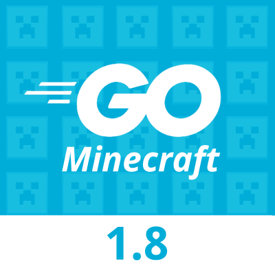

  

  <h2 align="center"><strong>Go Server API</strong></h3>

  

    Api Minecraft server 1.8 made in go
  

  
 This api is used to make plugins for the server 

  <a href="https://github.com/MineLC/Go-Server/">
    <h2>
      <strong>Server</strong>
    </h2>
    
  </a>

